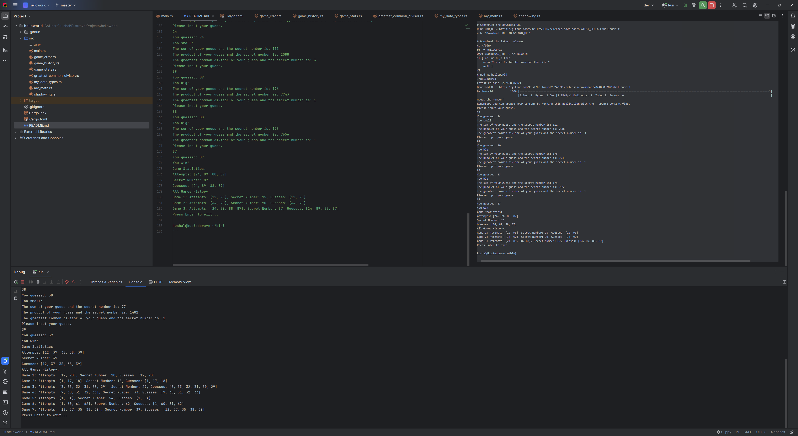

# Hello, Rust

Tested ok on fedora linux

```
kushal@kusfedoravm:~$ cd ~/bin; cat update_helloworld.sh; ./update_helloworld.sh
#!/bin/bash

# Define the repository owner and name
OWNER="kusl"
REPO="hellorust20240711"

# Fetch the latest release tag including pre-releases using the GitHub API
LATEST_RELEASE=$(curl -s "https://api.github.com/repos/$OWNER/$REPO/releases" | grep -m 1 "tag_name" | cut -d '"' -f 4)
if [ -z "$LATEST_RELEASE" ]; then
    echo "Error: Could not fetch the latest release tag."
    exit 1
fi
echo "Latest release: $LATEST_RELEASE"

# Construct the download URL
DOWNLOAD_URL="https://github.com/$OWNER/$REPO/releases/download/$LATEST_RELEASE/helloworld"
echo "Download URL: $DOWNLOAD_URL"

# Download the latest release
cd ~/bin/
rm -f helloworld
wget $DOWNLOAD_URL -O helloworld
if [ $? -ne 0 ]; then
    echo "Error: Failed to download the file."
    exit 1
fi
chmod +x helloworld
./helloworld
Latest release: 202408082021
Download URL: https://github.com/kusl/hellorust20240711/releases/download/202408082021/helloworld
helloworld           100% [==============================================================================================================================================================>]    3.69M    7.68MB/s
                          [Files: 1  Bytes: 3.69M [3.66MB/s] Redirects: 1  Todo: 0  Errors: 0                                                                                             ]
Guess the number!
Remember, you can update your consent by running this application with the --update-consent flag.
Please input your guess.
12
You guessed: 12
Too small!
The sum of your guess and the secret number is: 107
The product of your guess and the secret number is: 1140
The greatest common divisor of your guess and the secret number is: 1
Please input your guess.
95
You guessed: 95
You win!
Game Statistics:
Attempts: [12, 95]
Secret Number: 95
Guesses: [12, 95]
All Games History:
Game 1: Attempts: [12, 95], Secret Number: 95, Guesses: [12, 95]
Press Enter to exit...

kushal@kusfedoravm:~/bin$ cd ~/bin; cat update_helloworld.sh; ./update_helloworld.sh
#!/bin/bash

# Define the repository owner and name
OWNER="kusl"
REPO="hellorust20240711"

# Fetch the latest release tag including pre-releases using the GitHub API
LATEST_RELEASE=$(curl -s "https://api.github.com/repos/$OWNER/$REPO/releases" | grep -m 1 "tag_name" | cut -d '"' -f 4)
if [ -z "$LATEST_RELEASE" ]; then
    echo "Error: Could not fetch the latest release tag."
    exit 1
fi
echo "Latest release: $LATEST_RELEASE"

# Construct the download URL
DOWNLOAD_URL="https://github.com/$OWNER/$REPO/releases/download/$LATEST_RELEASE/helloworld"
echo "Download URL: $DOWNLOAD_URL"

# Download the latest release
cd ~/bin/
rm -f helloworld
wget $DOWNLOAD_URL -O helloworld
if [ $? -ne 0 ]; then
    echo "Error: Failed to download the file."
    exit 1
fi
chmod +x helloworld
./helloworld
Latest release: 202408082021
Download URL: https://github.com/kusl/hellorust20240711/releases/download/202408082021/helloworld
helloworld           100% [==============================================================================================================================================================>]    3.69M   15.85MB/s
                          [Files: 1  Bytes: 3.69M [7.73MB/s] Redirects: 1  Todo: 0  Errors: 0                                                                                             ]
Guess the number!
Remember, you can update your consent by running this application with the --update-consent flag.
Please input your guess.
34
You guessed: 34
Too small!
The sum of your guess and the secret number is: 124
The product of your guess and the secret number is: 3060
The greatest common divisor of your guess and the secret number is: 2
Please input your guess.
90
You guessed: 90
You win!
Game Statistics:
Attempts: [34, 90]
Secret Number: 90
Guesses: [34, 90]
All Games History:
Game 1: Attempts: [12, 95], Secret Number: 95, Guesses: [12, 95]
Game 2: Attempts: [34, 90], Secret Number: 90, Guesses: [34, 90]
Press Enter to exit...

kushal@kusfedoravm:~/bin$ cd ~/bin; cat update_helloworld.sh; ./update_helloworld.sh
#!/bin/bash

# Define the repository owner and name
OWNER="kusl"
REPO="hellorust20240711"

# Fetch the latest release tag including pre-releases using the GitHub API
LATEST_RELEASE=$(curl -s "https://api.github.com/repos/$OWNER/$REPO/releases" | grep -m 1 "tag_name" | cut -d '"' -f 4)
if [ -z "$LATEST_RELEASE" ]; then
    echo "Error: Could not fetch the latest release tag."
    exit 1
fi
echo "Latest release: $LATEST_RELEASE"

# Construct the download URL
DOWNLOAD_URL="https://github.com/$OWNER/$REPO/releases/download/$LATEST_RELEASE/helloworld"
echo "Download URL: $DOWNLOAD_URL"

# Download the latest release
cd ~/bin/
rm -f helloworld
wget $DOWNLOAD_URL -O helloworld
if [ $? -ne 0 ]; then
    echo "Error: Failed to download the file."
    exit 1
fi
chmod +x helloworld
./helloworld
Latest release: 202408082021
Download URL: https://github.com/kusl/hellorust20240711/releases/download/202408082021/helloworld
helloworld           100% [==============================================================================================================================================================>]    3.69M   31.53MB/s
                          [Files: 1  Bytes: 3.69M [7.85MB/s] Redirects: 1  Todo: 0  Errors: 0                                                                                             ]
Guess the number!
Remember, you can update your consent by running this application with the --update-consent flag.
Please input your guess.
24
You guessed: 24
Too small!
The sum of your guess and the secret number is: 111
The product of your guess and the secret number is: 2088
The greatest common divisor of your guess and the secret number is: 3
Please input your guess.
89
You guessed: 89
Too big!
The sum of your guess and the secret number is: 176
The product of your guess and the secret number is: 7743
The greatest common divisor of your guess and the secret number is: 1
Please input your guess.
88
You guessed: 88
Too big!
The sum of your guess and the secret number is: 175
The product of your guess and the secret number is: 7656
The greatest common divisor of your guess and the secret number is: 1
Please input your guess.
87
You guessed: 87
You win!
Game Statistics:
Attempts: [24, 89, 88, 87]
Secret Number: 87
Guesses: [24, 89, 88, 87]
All Games History:
Game 1: Attempts: [12, 95], Secret Number: 95, Guesses: [12, 95]
Game 2: Attempts: [34, 90], Secret Number: 90, Guesses: [34, 90]
Game 3: Attempts: [24, 89, 88, 87], Secret Number: 87, Guesses: [24, 89, 88, 87]
Press Enter to exit...

kushal@kusfedoravm:~/bin$
```




```bash
kushal@kusfedora2024:~/Videos/downloaded$ cd /home/kushal/src/rustlang/hellorust; time cargo update
    Updating crates.io index
     Locking 118 packages to latest compatible versions
    Updating bitflags v2.6.0 -> v2.9.0
    Updating bumpalo v3.16.0 -> v3.17.0
    Removing byteorder v1.5.0
    Updating bytes v1.8.0 -> v1.10.1
    Updating cc v1.1.31 -> v1.2.16
      Adding displaydoc v0.2.5
    Updating equivalent v1.0.1 -> v1.0.2
    Updating errno v0.3.9 -> v0.3.10
    Updating fastrand v2.1.1 -> v2.3.0
      Adding getrandom v0.3.2
    Updating h2 v0.4.6 -> v0.4.8
    Updating hashbrown v0.15.0 -> v0.15.2
    Removing hermit-abi v0.3.9
    Updating home v0.5.9 -> v0.5.11
    Updating http v1.1.0 -> v1.3.1
    Updating http-body-util v0.1.2 -> v0.1.3
    Updating httparse v1.9.5 -> v1.10.1
    Updating hyper v1.5.0 -> v1.6.0
    Updating hyper-rustls v0.27.3 -> v0.27.5
    Updating hyper-util v0.1.9 -> v0.1.10
      Adding icu_collections v1.5.0
      Adding icu_locid v1.5.0
      Adding icu_locid_transform v1.5.0
      Adding icu_locid_transform_data v1.5.0
      Adding icu_normalizer v1.5.0
      Adding icu_normalizer_data v1.5.0
      Adding icu_properties v1.5.1
      Adding icu_properties_data v1.5.0
      Adding icu_provider v1.5.0
      Adding icu_provider_macros v1.5.0
    Updating idna v0.5.0 -> v1.0.3
      Adding idna_adapter v1.2.0
    Updating indexmap v2.6.0 -> v2.8.0
    Updating ipnet v2.10.1 -> v2.11.0
    Updating itoa v1.0.11 -> v1.0.15
    Updating js-sys v0.3.72 -> v0.3.77
    Updating libc v0.2.161 -> v0.2.171
    Updating linux-raw-sys v0.4.14 -> v0.9.3
      Adding litemap v0.7.5
    Updating log v0.4.22 -> v0.4.26
    Updating miniz_oxide v0.8.0 -> v0.8.5
    Updating mio v1.0.2 -> v1.0.3
    Updating native-tls v0.2.12 -> v0.2.14
    Updating object v0.36.5 -> v0.36.7
    Updating once_cell v1.20.2 -> v1.21.1
    Updating openssl v0.10.68 -> v0.10.71
    Updating openssl-probe v0.1.5 -> v0.1.6
    Updating openssl-sys v0.9.104 -> v0.9.106
    Updating pin-project-lite v0.2.15 -> v0.2.16
    Updating pkg-config v0.3.31 -> v0.3.32
    Updating ppv-lite86 v0.2.20 -> v0.2.21
    Updating proc-macro2 v1.0.89 -> v1.0.94
    Updating quote v1.0.37 -> v1.0.40
      Adding r-efi v5.2.0
    Updating reqwest v0.12.8 -> v0.12.14
    Updating ring v0.17.8 -> v0.17.14
    Updating rustix v0.38.37 -> v1.0.2
    Updating rustls v0.23.15 -> v0.23.25
    Updating rustls-pki-types v1.10.0 -> v1.11.0
    Updating rustls-webpki v0.102.8 -> v0.103.0
      Adding rustversion v1.0.20
    Updating ryu v1.0.18 -> v1.0.20
    Updating schannel v0.1.26 -> v0.1.27
    Updating security-framework-sys v2.12.0 -> v2.14.0
    Updating serde v1.0.213 -> v1.0.219
    Updating serde_derive v1.0.213 -> v1.0.219
    Updating serde_json v1.0.132 -> v1.0.140
    Updating smallvec v1.13.2 -> v1.14.0
    Updating socket2 v0.5.7 -> v0.5.8
    Removing spin v0.9.8
      Adding stable_deref_trait v1.2.0
    Updating syn v2.0.85 -> v2.0.100
    Updating sync_wrapper v1.0.1 -> v1.0.2
      Adding synstructure v0.13.1
    Updating tempfile v3.13.0 -> v3.19.0
    Updating thiserror v1.0.65 -> v1.0.69 (available: v2.0.12)
    Updating thiserror-impl v1.0.65 -> v1.0.69
      Adding tinystr v0.7.6
    Removing tinyvec v1.8.0
    Removing tinyvec_macros v0.1.1
    Updating tokio v1.41.0 -> v1.44.1
    Updating tokio-rustls v0.26.0 -> v0.26.2
    Updating tokio-util v0.7.12 -> v0.7.14
      Adding tower v0.5.2
      Adding tower-layer v0.3.3
    Updating tracing v0.1.40 -> v0.1.41
    Updating tracing-core v0.1.32 -> v0.1.33
    Removing unicode-bidi v0.3.17
    Updating unicode-ident v1.0.13 -> v1.0.18
    Removing unicode-normalization v0.1.24
    Updating url v2.5.2 -> v2.5.4
      Adding utf16_iter v1.0.5
      Adding utf8_iter v1.0.4
      Adding wasi v0.14.2+wasi-0.2.4
    Updating wasm-bindgen v0.2.95 -> v0.2.100
    Updating wasm-bindgen-backend v0.2.95 -> v0.2.100
    Updating wasm-bindgen-futures v0.4.45 -> v0.4.50
    Updating wasm-bindgen-macro v0.2.95 -> v0.2.100
    Updating wasm-bindgen-macro-support v0.2.95 -> v0.2.100
    Updating wasm-bindgen-shared v0.2.95 -> v0.2.100
    Updating web-sys v0.3.72 -> v0.3.77
      Adding windows-link v0.1.0
    Updating windows-registry v0.2.0 -> v0.4.0
    Updating windows-result v0.2.0 -> v0.3.1
    Updating windows-strings v0.1.0 -> v0.3.1
      Adding windows-targets v0.53.0
      Adding windows_aarch64_gnullvm v0.53.0
      Adding windows_aarch64_msvc v0.53.0
      Adding windows_i686_gnu v0.53.0
      Adding windows_i686_gnullvm v0.53.0
      Adding windows_i686_msvc v0.53.0
      Adding windows_x86_64_gnu v0.53.0
      Adding windows_x86_64_gnullvm v0.53.0
      Adding windows_x86_64_msvc v0.53.0
      Adding wit-bindgen-rt v0.39.0
      Adding write16 v1.0.0
      Adding writeable v0.5.5
      Adding yoke v0.7.5
      Adding yoke-derive v0.7.5
    Updating zerocopy v0.7.35 -> v0.8.23
    Updating zerocopy-derive v0.7.35 -> v0.8.23
      Adding zerofrom v0.1.6
      Adding zerofrom-derive v0.1.6
      Adding zerovec v0.10.4
      Adding zerovec-derive v0.10.3
note: pass `--verbose` to see 2 unchanged dependencies behind latest

real	0m1.184s
user	0m0.207s
sys	0m0.048s
kushal@kusfedora2024:~/src/rustlang/hellorust$ cd /home/kushal/src/rustlang/hellorust; time cargo update; time cargo check
    Blocking waiting for file lock on package cache
    Updating crates.io index
     Locking 0 packages to latest compatible versions
note: pass `--verbose` to see 3 unchanged dependencies behind latest

real	0m1.452s
user	0m0.198s
sys	0m0.048s
    Blocking waiting for file lock on package cache
   Compiling proc-macro2 v1.0.94
   Compiling unicode-ident v1.0.18
   Compiling libc v0.2.171
    Checking stable_deref_trait v1.2.0
    Checking bytes v1.10.1
    Checking pin-project-lite v0.2.16
    Checking itoa v1.0.15
   Compiling pkg-config v0.3.32
    Checking once_cell v1.21.1
    Checking writeable v0.5.5
   Compiling cc v1.2.16
    Checking litemap v0.7.5
    Checking smallvec v1.14.0
    Checking icu_locid_transform_data v1.5.0
   Compiling httparse v1.10.1
   Compiling openssl v0.10.71
    Checking hashbrown v0.15.2
    Checking equivalent v1.0.2
    Checking icu_properties_data v1.5.0
    Checking futures-util v0.3.31
   Compiling zerocopy v0.8.23
   Compiling serde v1.0.219
    Checking tracing-core v0.1.33
    Checking write16 v1.0.0
    Checking bitflags v2.9.0
    Checking icu_normalizer_data v1.5.0
    Checking utf16_iter v1.0.5
   Compiling native-tls v0.2.14
    Checking utf8_iter v1.0.4
    Checking log v0.4.26
    Checking openssl-probe v0.1.6
   Compiling serde_json v1.0.140
    Checking ryu v1.0.20
    Checking sync_wrapper v1.0.2
    Checking rustls-pki-types v1.11.0
    Checking tower-layer v0.3.3
   Compiling thiserror v1.0.69
    Checking ipnet v2.11.0
    Checking tracing v0.1.41
    Checking home v0.5.11
    Checking http v1.3.1
    Checking etcetera v0.8.0
    Checking indexmap v2.8.0
    Checking rustls-pemfile v2.2.0
   Compiling quote v1.0.40
   Compiling syn v2.0.100
    Checking socket2 v0.5.8
    Checking mio v1.0.3
    Checking getrandom v0.2.15
   Compiling openssl-sys v0.9.106
    Checking http-body v1.0.1
    Checking rand_core v0.6.4
    Checking http-body-util v0.1.3
    Checking tokio v1.44.1
    Checking ppv-lite86 v0.2.21
    Checking rand_chacha v0.3.1
    Checking rand v0.8.5
    Checking tokio-util v0.7.14
    Checking tower v0.5.2
   Compiling synstructure v0.13.1
    Checking h2 v0.4.8
   Compiling zerofrom-derive v0.1.6
   Compiling yoke-derive v0.7.5
   Compiling zerovec-derive v0.10.3
   Compiling displaydoc v0.2.5
   Compiling icu_provider_macros v1.5.0
   Compiling openssl-macros v0.1.1
   Compiling serde_derive v1.0.219
   Compiling thiserror-impl v1.0.69
    Checking zerofrom v0.1.6
    Checking yoke v0.7.5
    Checking zerovec v0.10.4
    Checking hyper v1.6.0
    Checking tinystr v0.7.6
    Checking icu_collections v1.5.0
    Checking icu_locid v1.5.0
    Checking icu_provider v1.5.0
    Checking hyper-util v0.1.10
    Checking icu_locid_transform v1.5.0
    Checking tokio-native-tls v0.3.1
    Checking icu_properties v1.5.1
    Checking hyper-tls v0.6.0
    Checking serde_urlencoded v0.7.1
    Checking icu_normalizer v1.5.0
    Checking idna_adapter v1.2.0
    Checking idna v1.0.3
    Checking url v2.5.4
    Checking reqwest v0.12.14
    Checking helloworld v0.1.1 (/home/kushal/src/rustlang/hellorust)
    Finished `dev` profile [unoptimized + debuginfo] target(s) in 6.36s

real	0m6.379s
user	0m26.710s
sys	0m6.506s
kushal@kusfedora2024:~/src/rustlang/hellorust$ 
kushal@kusfedora2024:~/src/rustlang/hellorust$ cd /home/kushal/src/rustlang/hellorust; time cargo update; time cargo check
    Updating crates.io index
     Locking 0 packages to latest compatible versions

real	0m0.788s
user	0m0.180s
sys	0m0.054s
    Checking getrandom v0.3.2
    Checking etcetera v0.10.0
    Checking thiserror v2.0.12
    Checking rand_core v0.9.3
    Checking rand_chacha v0.9.0
    Checking rand v0.9.0
    Checking helloworld v0.1.1 (/home/kushal/src/rustlang/hellorust)
warning: use of deprecated function `rand::thread_rng`: renamed to `rng`
  --> src/main.rs:81:31
   |
81 |     let secret_number = rand::thread_rng().gen_range(1..=100);
   |                               ^^^^^^^^^^
   |
   = note: `#[warn(deprecated)]` on by default

warning: use of deprecated method `rand::Rng::gen_range`: Renamed to `random_range`
  --> src/main.rs:81:44
   |
81 |     let secret_number = rand::thread_rng().gen_range(1..=100);
   |                                            ^^^^^^^^^

warning: `helloworld` (bin "helloworld") generated 2 warnings
    Finished `dev` profile [unoptimized + debuginfo] target(s) in 0.57s

real	0m0.597s
user	0m0.450s
sys	0m0.206s
kushal@kusfedora2024:~/src/rustlang/hellorust$ 
kushal@kusfedora2024:~/src/rustlang/hellorust$ cd /home/kushal/src/rustlang/hellorust; time cargo update; time cargo check
    Updating crates.io index
     Locking 0 packages to latest compatible versions

real	0m1.023s
user	0m0.196s
sys	0m0.053s
    Checking helloworld v0.1.1 (/home/kushal/src/rustlang/hellorust)
    Finished `dev` profile [unoptimized + debuginfo] target(s) in 0.13s

real	0m0.149s
user	0m0.073s
sys	0m0.075s
kushal@kusfedora2024:~/src/rustlang/hellorust$ 
kushal@kusfedora2024:~/src/rustlang/hellorust$ cd /home/kushal/src/rustlang/hellorust; time cargo update; time cargo check
    Updating crates.io index
     Locking 0 packages to latest compatible versions

real	0m0.773s
user	0m0.188s
sys	0m0.047s
    Finished `dev` profile [unoptimized + debuginfo] target(s) in 0.05s

real	0m0.073s
user	0m0.037s
sys	0m0.037s
kushal@kusfedora2024:~/src/rustlang/hellorust$ cd /home/kushal/src/rustlang/hellorust; time cargo update; time cargo check; time cargo build; time cargo test; time cargo clippy; time cargo fmt; git status; date;
    Updating crates.io index
     Locking 0 packages to latest compatible versions

real	0m0.757s
user	0m0.190s
sys	0m0.053s
    Finished `dev` profile [unoptimized + debuginfo] target(s) in 0.05s

real	0m0.068s
user	0m0.035s
sys	0m0.034s
   Compiling stable_deref_trait v1.2.0
   Compiling pin-project-lite v0.2.16
   Compiling bytes v1.10.1
   Compiling futures-core v0.3.31
   Compiling cfg-if v1.0.0
   Compiling itoa v1.0.15
   Compiling once_cell v1.21.1
   Compiling litemap v0.7.5
   Compiling futures-sink v0.3.31
   Compiling writeable v0.5.5
   Compiling libc v0.2.171
   Compiling smallvec v1.14.0
   Compiling fnv v1.0.7
   Compiling zerofrom v0.1.6
   Compiling slab v0.4.9
   Compiling memchr v2.7.4
   Compiling icu_locid_transform_data v1.5.0
   Compiling hashbrown v0.15.2
   Compiling futures-io v0.3.31
   Compiling icu_properties_data v1.5.0
   Compiling futures-task v0.3.31
   Compiling pin-utils v0.1.0
   Compiling yoke v0.7.5
   Compiling foreign-types-shared v0.1.1
   Compiling equivalent v1.0.2
   Compiling utf8_iter v1.0.4
   Compiling foreign-types v0.3.2
   Compiling tracing-core v0.1.33
   Compiling utf16_iter v1.0.5
   Compiling try-lock v0.2.5
   Compiling atomic-waker v1.1.2
   Compiling bitflags v2.9.0
   Compiling write16 v1.0.0
   Compiling icu_normalizer_data v1.5.0
   Compiling httparse v1.10.1
   Compiling futures-channel v0.3.31
   Compiling want v0.3.1
   Compiling zerovec v0.10.4
   Compiling log v0.4.26
   Compiling openssl-probe v0.1.6
   Compiling tower-service v0.3.3
   Compiling percent-encoding v2.3.1
   Compiling serde v1.0.219
   Compiling zerocopy v0.8.23
   Compiling ryu v1.0.20
   Compiling sync_wrapper v1.0.2
   Compiling tower-layer v0.3.3
   Compiling form_urlencoded v1.2.1
   Compiling rustls-pki-types v1.11.0
   Compiling encoding_rs v0.8.35
   Compiling base64 v0.22.1
   Compiling home v0.5.11
   Compiling mime v0.3.17
   Compiling ipnet v2.11.0
   Compiling etcetera v0.10.0
   Compiling tracing v0.1.41
   Compiling futures-util v0.3.31
   Compiling http v1.3.1
   Compiling indexmap v2.8.0
   Compiling rustls-pemfile v2.2.0
   Compiling mio v1.0.3
   Compiling socket2 v0.5.8
   Compiling openssl-sys v0.9.106
   Compiling getrandom v0.3.2
   Compiling thiserror v2.0.12
   Compiling dotenv v0.15.0
   Compiling rand_core v0.9.3
   Compiling tokio v1.44.1
   Compiling tinystr v0.7.6
   Compiling icu_collections v1.5.0
   Compiling icu_locid v1.5.0
   Compiling http-body v1.0.1
   Compiling http-body-util v0.1.3
   Compiling icu_provider v1.5.0
   Compiling ppv-lite86 v0.2.21
   Compiling openssl v0.10.71
   Compiling icu_locid_transform v1.5.0
   Compiling rand_chacha v0.9.0
   Compiling rand v0.9.0
   Compiling icu_properties v1.5.1
   Compiling serde_urlencoded v0.7.1
   Compiling serde_json v1.0.140
   Compiling icu_normalizer v1.5.0
   Compiling tokio-util v0.7.14
   Compiling tower v0.5.2
   Compiling idna_adapter v1.2.0
   Compiling h2 v0.4.8
   Compiling idna v1.0.3
   Compiling native-tls v0.2.14
   Compiling tokio-native-tls v0.3.1
   Compiling url v2.5.4
   Compiling hyper v1.6.0
   Compiling hyper-util v0.1.10
   Compiling hyper-tls v0.6.0
   Compiling reqwest v0.12.14
   Compiling helloworld v0.1.1 (/home/kushal/src/rustlang/hellorust)
    Finished `dev` profile [unoptimized + debuginfo] target(s) in 7.57s

real	0m7.594s
user	0m32.199s
sys	0m6.323s
   Compiling helloworld v0.1.1 (/home/kushal/src/rustlang/hellorust)
    Finished `test` profile [unoptimized + debuginfo] target(s) in 0.90s
     Running unittests src/main.rs (target/debug/deps/helloworld-cdc224977c18d98a)

running 24 tests
test graph::tests::test_bfs ... ok
test graph::tests::test_dfs ... ok
test greatest_common_divisor::tests::test_large_composite_numbers ... ok
test greatest_common_divisor::tests::test_both_are_zero ... ok
test greatest_common_divisor::tests::test_gcd ... ok
test greatest_common_divisor::tests::test_large_numbers ... ok
test greatest_common_divisor::tests::test_large_numbers_performance ... ok
test greatest_common_divisor::tests::test_large_numbers_performance_single ... ok
test greatest_common_divisor::tests::test_large_prime_numbers ... ok
test greatest_common_divisor::tests::test_mixed_numbers ... ok
test greatest_common_divisor::tests::test_one_is_one ... ok
test greatest_common_divisor::tests::test_large_numbers_performance_multiple ... ok
test greatest_common_divisor::tests::test_one_is_zero ... ok
test greatest_common_divisor::tests::test_prime_numbers ... ok
test greatest_common_divisor::tests::test_zero_input ... ok
test greatest_common_divisor::tests::test_zero_input_3 ... ok
test my_data_types::tests::test_not_a_number ... ok
test my_math::tests::test_add ... ok
test my_math::tests::test_add_multiply_ambiguous ... ok
test my_math::tests::test_add_zero ... ok
test my_math::tests::test_multiply ... ok
test my_math::tests::test_multiply_zero ... ok
test shadowing::tests::test_shadow ... ok
test shadowing::tests::test_shadow_string_length ... ok

test result: ok. 24 passed; 0 failed; 0 ignored; 0 measured; 0 filtered out; finished in 0.00s


real	0m0.924s
user	0m0.598s
sys	0m0.381s
warning: use of `or_insert` to construct default value
  --> src/graph.rs:15:45
   |
15 |         self.nodes.entry(value.to_string()).or_insert(Vec::new());
   |                                             ^^^^^^^^^^^^^^^^^^^^^ help: try: `or_default()`
   |
   = help: for further information visit https://rust-lang.github.io/rust-clippy/master/index.html#unwrap_or_default
   = note: `#[warn(clippy::unwrap_or_default)]` on by default

warning: `helloworld` (bin "helloworld") generated 1 warning (run `cargo clippy --fix --bin "helloworld"` to apply 1 suggestion)
    Finished `dev` profile [unoptimized + debuginfo] target(s) in 0.08s

real	0m0.131s
user	0m0.065s
sys	0m0.067s

real	0m0.082s
user	0m0.044s
sys	0m0.034s
On branch master
Your branch is up to date with 'origin/master'.

Changes not staged for commit:
  (use "git add <file>..." to update what will be committed)
  (use "git restore <file>..." to discard changes in working directory)
	modified:   Cargo.lock
	modified:   Cargo.toml
	modified:   README.md
	modified:   src/graph.rs
	modified:   src/greatest_common_divisor.rs
	modified:   src/main.rs
	modified:   src/my_data_types.rs
	modified:   src/shadowing.rs

no changes added to commit (use "git add" and/or "git commit -a")
Tue Mar 18 09:11:33 AM EDT 2025
kushal@kusfedora2024:~/src/rustlang/hellorust$ 


```